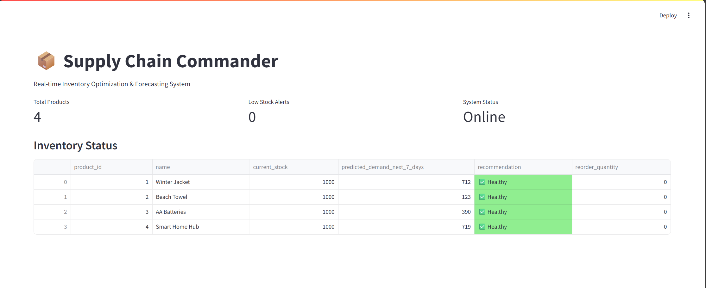
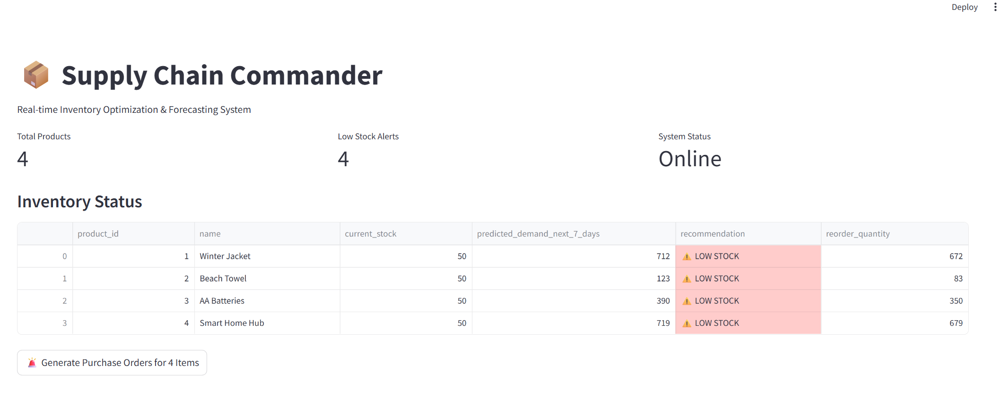

# 📦 Supply Chain Commander: End-to-End Inventory AI


**A Full-Stack AI system that automates inventory reordering by predicting future demand.**

Unlike static analysis notebooks, this project is a live **Decision Support System**. It ingests sales data, trains seasonality-aware forecasting models (Prophet), and exposes actionable insights via a REST API and an interactive dashboard.

---

## 🚀 The Business Problem
Retailers lose money in two ways:
1.  **Stockouts:** Losing sales because popular items (e.g., Winter Jackets) run out during peak season.
2.  **Overstocking:** Wasting cash on inventory that sits in a warehouse (e.g., Beach Towels in December).

**The Solution:** An automated system that predicts demand 7 days in advance and triggers "Low Stock" alerts *only* when predicted demand exceeds current inventory.

---

## 🏗️ Architecture

The system follows a microservices-style 3-tier architecture:

1.  **Data Layer (PostgreSQL/Docker):**
    * Stores raw transaction history and the "State of the World" (Current Stock).
    * Acts as the single source of truth for both the training pipeline and the API.
2.  **ML Pipeline (Prophet):**
    * Runs purely on backend logic (no manual CSV exports).
    * Detects **Seasonality** (Winter vs. Summer) and **Trends** (Growing popularity).
    * Writes forecasts *back* to the database (`demand_forecasts` table) for low-latency retrieval.
3.  **Application Layer (FastAPI + Streamlit):**
    * **API:** Exposes a clean endpoint (`GET /inventory/status`) that applies business logic (e.g., `if stock < demand: alert`).
    * **Frontend:** A dashboard for Supply Chain Managers to view alerts and "One-Click Approve" purchase orders.

---

## 📸 Screenshots

**1. The "Healthy" State (No Action Needed)**
*System predicts low demand for seasonal items in off-season.*


**2. The "Critical" State (Action Required)**
*System detects High Demand (Winter) vs. Low Stock, triggering alerts.*


---

## 🛠️ Tech Stack

| Component | Technology | Why I chose it? |
| :--- | :--- | :--- |
| **Database** | PostgreSQL | Relational integrity for transactional data; "Real world" standard. |
| **Infrastructure** | Docker Compose | Ensures reproducibility; spin up the DB with one command. |
| **Forecasting** | Facebook Prophet | robust to missing data and handles seasonality better than ARIMA. |
| **Backend API** | FastAPI | Async performance; auto-generates Swagger documentation. |
| **Frontend** | Streamlit | Rapid prototyping of data-heavy UIs for business stakeholders. |

---

## ⚡ Quick Start

### Prerequisites
* Docker Desktop (Running)
* Python 3.9+

### 1. Spin up the Infrastructure
Start the PostgreSQL database container.
```bash
docker compose up -d
```
### 2. ETL & Simulation
Generate mock sales data (with seasonality patterns) and load the schema.

```bash

# Generates mock history ending "Yesterday" (Dynamic)
python generate_mock_data.py

# Creates tables and loads initial data
python setup_database.py
```

### 3. Train the Brain
Run the training pipeline. This fetches data from SQL, trains Prophet models, and saves forecasts.

```bash

python train_model.py
```

### 4. Launch the App
Run the Backend (API) and Frontend (Dashboard) in separate terminals.

Terminal A (API):

```bash

uvicorn main:app --reload
Terminal B (Frontend):
```
```bash

streamlit run dashboard.py
```
---

## 🧪 Key Features & Engineering Decisions
#### Idempotent Pipelines: 
The setup_database.py script checks for existing tables and cleans up, allowing for safe re-runs during development.

#### Time-Travel Debugging: 
The model training logic aligns training data relative to "Today" to prevent data leakage or "zero-prediction" bugs caused by date mismatches.

#### Business Logic Layer: 
The API doesn't just return raw numbers; it calculates a reorder_quantity based on a safety buffer, simulating real ERP logic.

--- 

## 🔮 Future Improvements
#### Uplift Modeling: 
Instead of just predicting demand, predict which customers are persuadable to prevent churn during stockouts.

#### Containerization: 
Dockerize the Python scripts so the entire app (DB + App + UI) runs with a single docker compose up.

#### Auth: 
Add JWT authentication to the FastAPI endpoint to secure the data.

---
